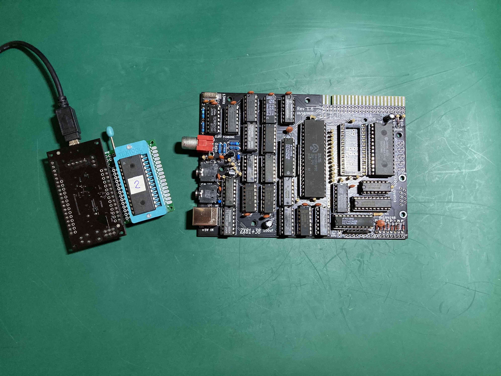

# ZX81plus38 Build

This is the log of my build of the ZX81plus38 clone of the ZX81.

I want to build some add-on interfaces for the ZX81 and I don't want
to risk damaging my one working ZX81 when testing them. So I decided
to build a modern ZX81 clone to test these interfaces. [Wikipedia](https://en.wikipedia.org/wiki/List_of_ZX80_and_ZX81_clones) lists a number of options and
in the end I decided on the [ZX81plus38](https://github.com/mahjongg2/ZX81plus38).

I wish to express thanks to [Mahjongg](https://revspace.nl/Mahjongg) for 
creating the ZXplus38: Mijn hartelijke dank, hij doet het uitstekend!

## Components

I bought the required components from Ebay and Aliexpress. Ebay has listings 
for PCBs and IC kits for the ZXpplus38.

I bought a zx81plus38 PCB at revision 1.6 from a European seller. Revision 1.6 
is not the most recent revision. Revision 1.9 includes pull-up resistors for 
the joystick connections, but this revision was not on offer when I bought the 
PCB. I'm not making use of the joystick interface, so it doesn't make a 
difference for me. Revision 1.9 also has the connector for internal keyboard in a more natural order. I intended to use an external keyboard so that did not bother me either.

I also bought an IC kit for the ZX81plus38 from a Chinese seller on Ebay. This kit 
includes a Z80, a ROM EPROM and an SRAM IC as well as the logic ICs. Buying a 
kit saved me some effort in ordering all the components individually.

The IC kit includes an AT27C256 EPROM, but I do not have a suitable programmer. 
I therefore chose to use an AT28C256 EEPROM that I could flash using an 
[ATmega32u4](https://github.com/kintsugi-computer/AT28C256Programmer). I got the AT28C256 from Aliexpress, as well as a couple of AT28C64 
EEPROMs.

Finally, the standard components such as DIP sockets, resistors, connectors
and capacitors were found in my parts bin or bought on Aliexpress.

## Build

I largely followed the [build and test manual](https://github.com/mahjongg2/ZX81plus38/blob/master/building%20and%20testing%20the%20ZX81%2B38.pdf), but I skipped everything that had to do with the joystick connector.

I first put in the connectors, the crystal, ceramic capacitors, resistors and 
diodes, followed by the DIP sockets.

The electrolytic capacitors and transistors came next.

I modified the JP10 jumper by scratching out the default connection to GND 
and tying pin 27 of the EEPROM to 5V (/WE is inactive).

The final step was putting all the ICs into the sockets and programming the
EPROM using my [home-built programmer](https://github.com/kintsugi-computer/AT28C256Programmer).
I succeeded in programming the AT28C256 EEPROM and two out of the five 
AT28C64 EEPROM with the ZX81 ROM. Three of AT28C64s turned out to be defective.
I uploaded 4 copies of the 8K ZX81 ROM into the 32K space of the AT28C256 and
used that for this build.

## Test

Before testing I inspected all the solder points and convinced myself these
were all OK. I connected the ZX81plus38 to the composite video input of a 
small LCD TV and powered it up using a 1A USB phone charger. This gave me a 
white screen without the expected K cursor. This meant that a 
recognizable video signal was being produced, but without pixel data.

I had not expected it to work immediately and I had prepared by buying an 
affordable 8-channel USB logic analyzer and some clip-on leads from Aliexpress.

This particular
model is compatible with Sigrok and the Saleae Logic2 software. This allowed me to 
inspect the signals on the Z80 pins and these all seemed to be working fine.

I then had a look at the EEPROM and the RAM chips, and the RAM appeared
defective when I tested that using my home-built programmer. I had gained some
doubts about the quality of the Chinese offers, and I ordered RAM replacements
from a [Dutch seller on Ebay](https://www.ebay.nl/usr/evrieze), who turned out
to be most helpful and knowledgeable.

I was hoping for success after replacing the RAM chip, but I was still greeted
by either a white screen or a garbled pattern of black and white. I used
the logic analyzer to probe the signals going into and coming out of the 74LS165 pixel shift register (IC U9). This showed that the shift register itself was working fine but I was not sure about the signals that it was receiving. Pushing 
down a bit on the chip seemed to change the garbled pattern on the screen and
this made me suspect a bad solder connection. I touched them all up, powered up again and now was greeted 
by the "K" cursor.

## External keyboard

I thought to use an external Memotech keyboard for the ZX81 and connected
that to the ZX81plus38 after disconnecting the power. However, the keyboard
did not work. After some searching on the Internet I found a blog post by
[Tynemouth Software](http://blog.tynemouthsoftware.co.uk/2022/05/zx81-external-keyboards-and-the-minstrel-3.html) that explains the issue in relation to the
Minstrel ZX81 clone.

External keyboards connect to the edge connector and need to pull 
the relevant datalines low for the keypresses to register. These datalines
are pulled up to 5V by the outputs of the logic IC that interfaces to the 
internal keyboard connectors. And these datalines are isolated from the edge 
connector by means of resistors.

This means that pulling down the datalines on the edge connector 
using logic ICs has no effect on the state of the data lines on the other 
side of the isolating resistors.

The Tynemouth Software blog post suggests a solution that uses the 
internal keyboard connectors. I decided to check up on the datasheet of the
74HCT541 logic IC (U22, marked with "V" in the image below) after some contemplation and looking at the
schematics of the ZX81plus38. This is the IC that monitors the internal keyboard 
connection and pulls up the datalines on the CPU side of the isolating 
resistors unless a key is pressed on the internal keyboard. The datasheet 
specifically warns against leaving input pins floating, but it has no issue
with unconnected output pins. Given that I was not planning on using an 
internal keyboard anyway, it seemed an obvious solution to just disconnect
the output pins of the 74HCT541 that were interfering with the external
keyboard.

I popped the 74HCT541 IC out of its socket and bent the pins connecting 
to D0-D4 to reach over the edge of the DIP socket before putting it back in.

I powered the ZX81plus38 up again and typed in a simple one-liner:

And it works!

And this completes the build.

